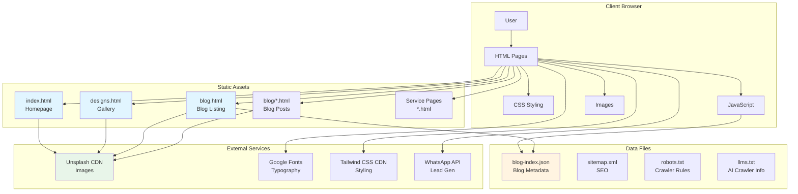
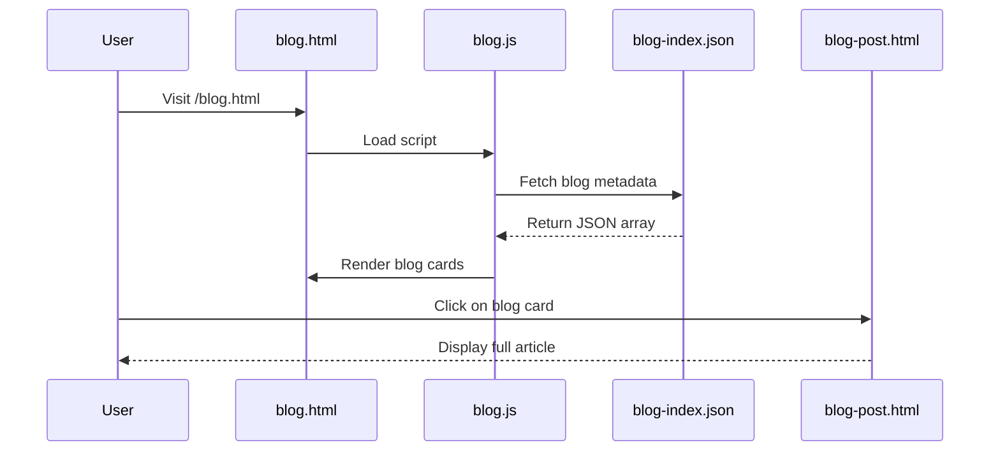
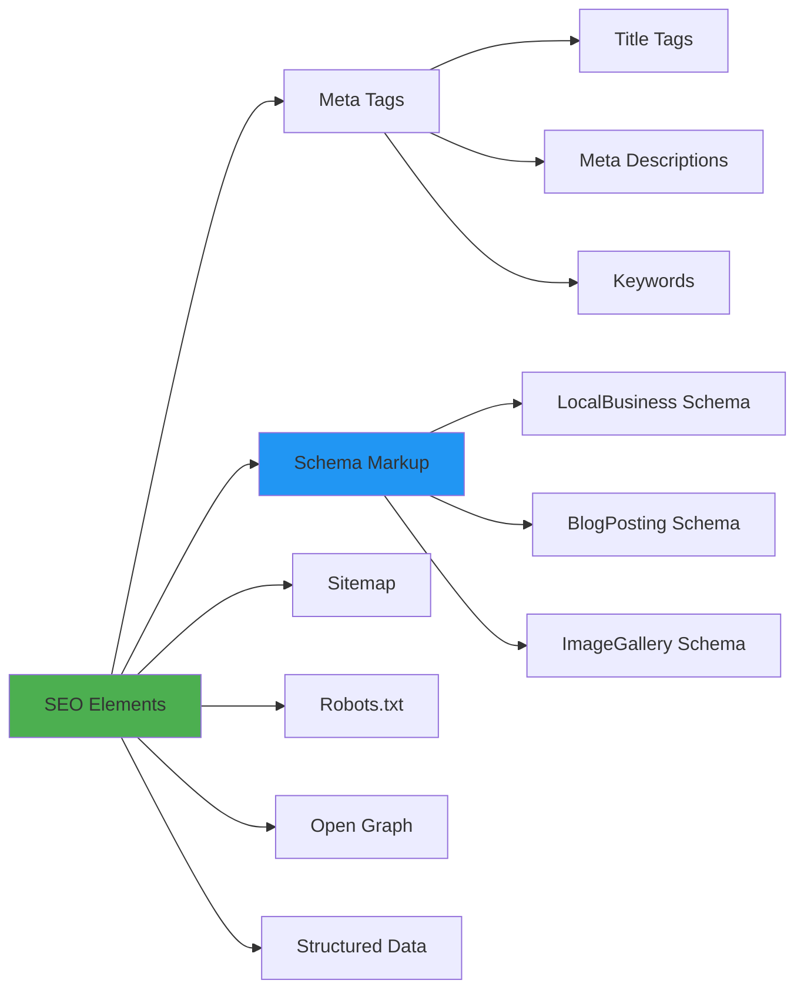
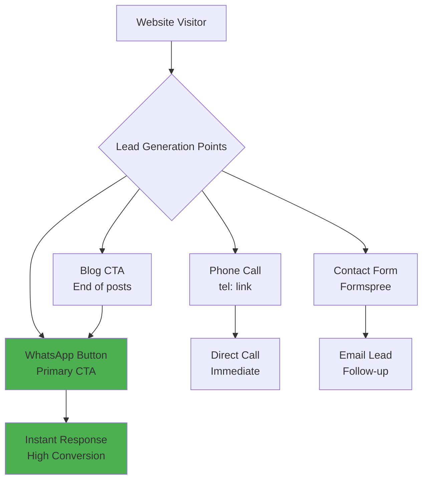
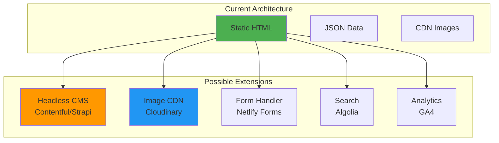

# High-Level Design (HLD) Document
## Design & Decor - False Ceiling & Gypsum Work Website

**Version:** 1.1  
**Last Updated:** January 2026  
**Domain:** https://designanddecor.in  
**Status:** Active Development

---

## Table of Contents

1. [System Overview](#system-overview)
2. [Architecture Diagram](#architecture-diagram)
3. [Routes & URL Structure](#routes--url-structure)
4. [File Structure](#file-structure)
5. [Content Management](#content-management)
   - [Updating Images](#updating-images)
   - [Updating Blog Posts](#updating-blog-posts)
   - [Updating Portfolio](#updating-portfolio)
6. [SEO Maintenance Guide](#seo-maintenance-guide)
7. [Lead Generation Optimization](#lead-generation-optimization)
8. [Extension Guide](#extension-guide)
9. [Technical Stack](#technical-stack)

---

## Implementation Summary

**Current Status:** 75% Complete

- ✅ **Core Pages:** 12 of 16 pages implemented
- ⚠️ **Blog Posts:** 1 of 3 posts exist (33%)
- ⚠️ **Location Pages:** 3 of 6 pages exist (50%)
- ⚠️ **Sitemap:** Incomplete (missing blog and location pages)
- ✅ **Features:** WhatsApp form modal, blog system, portfolio filters all functional

**Next Steps:**
1. Create missing blog posts (2 remaining)
2. Create missing location pages (3 remaining: Noida, Faridabad, Panipat)
3. Complete sitemap.xml with all pages
4. Configure Formspree form handler

---

## System Overview

Design & Decor is a static website built for a false ceiling and gypsum work contractor business serving Karnal and Delhi NCR region. The website is designed to:

- **Showcase Services**: Display false ceiling, gypsum partition, POP ceiling, and wall paneling services
- **Display Portfolio**: Showcase completed projects and design gallery
- **Publish Content**: Blog system for SEO and thought leadership
- **Generate Leads**: Multiple contact points (WhatsApp, Phone, Contact Form)
- **Local SEO**: Optimized for local search in Karnal and Delhi NCR

### Key Features

- ✅ Static HTML/CSS/JS website (no backend required)
- ✅ Responsive design (mobile-first)
- ✅ Blog system with JSON-based content management
- ✅ Image gallery with lightbox functionality
- ✅ SEO optimized (Schema markup, meta tags, sitemap)
- ✅ WhatsApp integration with form modal for instant lead generation
- ✅ Fast loading (CDN-based assets)
- ✅ Portfolio page with filter functionality
- ✅ Mobile sticky bottom bar for quick contact

---

## Architecture Diagram



---

## Routes & URL Structure

### Public Routes

```mermaid
graph LR
    A[Homepage<br/>/] --> B[Services Section<br/>/#services]
    A --> C[Portfolio Section<br/>/#portfolio]
    A --> D[Contact Section<br/>/#contact]
    
    A --> E[Designs Gallery<br/>/designs.html]
    A --> F[Blog Listing<br/>/blog.html]
    F --> G[Blog Post<br/>/blog/{id}.html]
    
    A --> H[Service Pages]
    H --> I[False Ceiling<br/>/false-ceiling-karnal.html]
    H --> J[Gypsum Partition<br/>/gypsum-partition-karnal.html]
    H --> K[POP Ceiling<br/>/pop-ceiling-karnal.html]
    
    A --> L[Location Pages]
    L --> M[/karnal.html]
    L --> N[/delhi.html]
    L --> O[/gurgaon.html]
    L --> P[/noida.html]
    L --> Q[/faridabad.html]
    L --> R[/panipat.html]
    
    style A fill:#4caf50
    style E fill:#2196f3
    style F fill:#ff9800
```

### Complete Route List

| Route | File | Status | Purpose | Priority |
|-------|------|--------|---------|----------|
| `/` | `index.html` | ✅ Implemented | Homepage with hero, services, portfolio | 1.0 |
| `/designs.html` | `designs.html` | ✅ Implemented | Design gallery (100+ images) | 0.9 |
| `/blog.html` | `blog.html` | ✅ Implemented | Blog listing page with category filters | 0.8 |
| `/blog/{id}.html` | `blog/{id}.html` | ⚠️ Partial | Individual blog post (1 of 3 exists) | 0.7 |
| `/false-ceiling-karnal.html` | `false-ceiling-karnal.html` | ✅ Implemented | Service page | 0.8 |
| `/gypsum-partition-karnal.html` | `gypsum-partition-karnal.html` | ✅ Implemented | Service page | 0.8 |
| `/pop-ceiling-karnal.html` | `pop-ceiling-karnal.html` | ✅ Implemented | Service page | 0.8 |
| `/wall-paneling-karnal.html` | `wall-paneling-karnal.html` | ✅ Implemented | Service page | 0.8 |
| `/karnal.html` | `karnal.html` | ✅ Implemented | Location-specific page | 0.7 |
| `/delhi.html` | `delhi.html` | ✅ Implemented | Location-specific page | 0.7 |
| `/gurgaon.html` | `gurgaon.html` | ✅ Implemented | Location-specific page | 0.7 |
| `/noida.html` | `noida.html` | ❌ Missing | Location-specific page | 0.7 |
| `/faridabad.html` | `faridabad.html` | ❌ Missing | Location-specific page | 0.7 |
| `/panipat.html` | `panipat.html` | ❌ Missing | Location-specific page | 0.7 |
| `/portfolio.html` | `portfolio.html` | ✅ Implemented | Portfolio showcase with filters | 0.7 |
| `/contact.html` | `contact.html` | ❌ Missing | Contact page (contact form in index.html) | 0.6 |

**Legend:**
- ✅ Implemented - File exists and is functional
- ⚠️ Partial - Partially implemented (e.g., some blog posts missing)
- ❌ Missing - Referenced but file doesn't exist

### Anchor Routes (Same Page)

- `/#services` - Services section on homepage
- `/#portfolio` - Portfolio section on homepage
- `/#contact` - Contact section on homepage

---

## File Structure

```
design-and-decor/
├── index.html                 # ✅ Homepage (main entry point)
├── designs.html              # ✅ Design gallery page
├── blog.html                 # ✅ Blog listing page
├── portfolio.html            # ✅ Portfolio showcase page
├── false-ceiling-karnal.html # ✅ Service page
├── gypsum-partition-karnal.html # ✅ Service page
├── pop-ceiling-karnal.html   # ✅ Service page
├── wall-paneling-karnal.html # ✅ Service page
├── karnal.html               # ✅ Location page
├── delhi.html                # ✅ Location page
├── gurgaon.html              # ✅ Location page
├── blog-index.json           # ✅ Blog posts metadata (JSON) - 3 entries
├── sitemap.xml               # ⚠️ SEO sitemap (incomplete - missing blog & location pages)
├── robots.txt                # ✅ Search engine crawler rules
├── llms.txt                  # ✅ AI crawler information
├── BLOG_TEMPLATE.md          # ✅ Blog post template guide
│
├── blog/                     # Blog posts directory
│   └── false-ceiling-design-trends-2026.html # ✅ (1 of 3 posts exists)
│   # Missing: gypsum-vs-pop-ceiling.html
│   # Missing: false-ceiling-cost-karnal.html
│
├── css/                      # Empty (using Tailwind CDN)
│
├── js/                       # JavaScript files
│   └── blog.js              # ✅ Blog system logic with category filters
│
└── images/                   # Empty (using Unsplash CDN)
```

**Current Implementation Status:**
- **Total Pages:** 12 implemented, 4 missing
- **Blog Posts:** 1 of 3 exist (33% complete)
- **Location Pages:** 3 of 6 exist (50% complete)
- **Sitemap:** Missing blog.html, blog posts, and location pages

### File Dependencies

```mermaid
graph TD
    A[index.html] --> B[blog-index.json]
    A --> C[designs.html]
    A --> D[blog.html]
    
    D --> B
    D --> E[js/blog.js]
    D --> F[blog/{id}.html]
    
    G[blog.html] --> B
    G --> E
    
    H[designs.html] --> I[Unsplash CDN]
    
    style A fill:#4caf50
    style B fill:#ff9800
    style E fill:#2196f3
```

---

## Content Management

### Updating Images

#### Method 1: Using Unsplash CDN (Current Implementation)

**Location**: Images are referenced via Unsplash CDN URLs in HTML files

**Steps to Update Images:**

1. **Find Image References:**
   ```bash
   grep -r "images.unsplash.com" *.html
   ```

2. **Replace Image URL:**
   - Open the HTML file containing the image
   - Find the `` tag with `src="https://images.unsplash.com/..."`
   - Replace with new Unsplash URL or your own image URL

3. **Image URL Format:**
   ```html
   
   ```

4. **Recommended Image Sizes:**
   - Hero images: `w=1200&q=80`
   - Gallery images: `w=800&q=80`
   - Thumbnails: `w=400&q=80`
   - Blog images: `w=800&q=80`

#### Method 2: Using Local Images (Recommended for Production)

**Steps to Add Local Images:**

1. **Upload Images:**
   ```bash
   # Create organized structure
   images/
   ├── hero/
   ├── gallery/
   ├── portfolio/
   └── blog/
   ```

2. **Update Image References:**
   ```html
   <!-- Change from -->
   
   
   <!-- To -->
   
   ```

3. **Image Optimization:**
   - Use WebP format for better compression
   - Optimize images before upload (use tools like TinyPNG, ImageOptim)
   - Maintain aspect ratios
   - Recommended max file size: 200KB per image

#### Method 3: Using Image CDN Service

**Recommended Services:**
- Cloudinary
- Imgix
- ImageKit

**Benefits:**
- Automatic optimization
- Responsive images
- Lazy loading
- Better performance

**Example:**
```html

```

### Updating Blog Posts

#### Blog System Architecture



#### Current Blog Post Status

**Implemented:**
- ✅ `blog/false-ceiling-design-trends-2026.html` - Published (2026-01-15)

**Missing (entries exist in blog-index.json but HTML files don't):**
- ❌ `blog/gypsum-vs-pop-ceiling.html` - Entry exists, file missing
- ❌ `blog/false-ceiling-cost-karnal.html` - Entry exists, file missing

**Action Required:** Create the 2 missing blog post HTML files to match blog-index.json entries.

#### Steps to Add a New Blog Post

**Step 1: Create Blog Post HTML File**

1. Create a new file in `blog/` directory:
   ```bash
   blog/{slug}.html
   ```
   
   Example: `blog/gypsum-vs-pop-ceiling.html`
   
   **Note:** Use `BLOG_TEMPLATE.md` as a reference for structure.

2. Use this template structure:
   ```html
   <!DOCTYPE html>
   <html lang="en">
   <head>
       <meta charset="UTF-8">
       <meta name="viewport" content="width=device-width, initial-scale=1.0">
       <title>{Blog Title} | Design & Decor</title>
       <meta name="description" content="{Blog excerpt}">
       
       <!-- Open Graph -->
       <meta property="og:title" content="{Blog Title}">
       <meta property="og:description" content="{Blog excerpt}">
       <meta property="og:image" content="{Blog image URL}">
       
       <!-- Schema Markup -->
       <script type="application/ld+json">
       {
           "@context": "https://schema.org",
           "@type": "BlogPosting",
           "headline": "{Blog Title}",
           "description": "{Blog excerpt}",
           "image": "{Blog image URL}",
           "author": {
               "@type": "Organization",
               "name": "Design & Decor"
           },
           "datePublished": "{YYYY-MM-DD}",
           "dateModified": "{YYYY-MM-DD}"
       }
       </script>
       
       <!-- Include same head styles as blog.html -->
   </head>
   <body>
       <!-- Header (same as other pages) -->
       <!-- Blog Content -->
       <!-- Footer -->
   </body>
   </html>
   ```

**Step 2: Add Entry to blog-index.json**

1. Open `blog-index.json`
2. Add new entry at the beginning of the array:
   ```json
   {
     "id": "your-blog-slug",
     "title": "Your Blog Title",
     "excerpt": "Brief description (150-160 characters)",
     "author": "Design & Decor Team",
     "date": "2026-01-20",
     "category": "Guide",
     "readTime": "5 min read",
     "image": "https://images.unsplash.com/photo-...?w=800&q=80",
     "tags": ["tag1", "tag2", "tag3"]
   }
   ```

3. **Field Descriptions:**
   - `id`: URL slug (must match HTML filename without .html)
   - `title`: Blog post title (60-70 characters for SEO)
   - `excerpt`: Meta description (150-160 characters)
   - `date`: Publication date (YYYY-MM-DD format)
   - `category`: One of: "Design Trends", "Guide", "Pricing", "Tips"
   - `readTime`: Estimated reading time
   - `image`: Featured image URL
   - `tags`: Array of relevant keywords

**Step 3: Update sitemap.xml**

Add new URL entry:
```xml
<url>
    <loc>https://designanddecor.in/blog/{slug}.html</loc>
    <lastmod>2026-01-20</lastmod>
    <changefreq>monthly</changefreq>
    <priority>0.7</priority>
</url>
```

**Step 4: Verify**

1. Open `blog.html` in browser
2. Verify new post appears in listing
3. Click to verify it links correctly
4. Check mobile responsiveness

#### Blog Post Best Practices

**Content Structure:**
- Use H2 for main sections
- Use H3 for subsections
- Include 3-5 images per post
- Add internal links to service pages
- Include call-to-action (WhatsApp button)

**SEO Optimization:**
- Target keyword in title and first paragraph
- Use keyword in H2 headings (2-3 times)
- Include related keywords naturally
- Add alt text to all images
- Internal linking to other pages

**Example Blog Post Structure:**
```html
<article class="prose max-w-4xl mx-auto">
    <h1>Blog Title</h1>
    <p>Introduction paragraph...</p>
    
    <h2>Main Section 1</h2>
    <p>Content...</p>
    
    
    <h2>Main Section 2</h2>
    <p>Content...</p>
    
    <h3>Subsection</h3>
    <ul>
        <li>Point 1</li>
        <li>Point 2</li>
    </ul>
    
    <!-- CTA Section -->
    <div class="bg-whatsapp text-white p-6 rounded-xl">
        <h3>Ready to Get Started?</h3>
        <a href="https://wa.me/919355510817">Contact Us on WhatsApp</a>
    </div>
</article>
```

### Updating Portfolio

**Current Implementation:**
Portfolio items are hardcoded in `index.html` under the Portfolio section.

**Steps to Update:**

1. **Find Portfolio Section:**
   ```html
   <section id="portfolio" class="py-16 md:py-24 bg-white">
   ```

2. **Add New Portfolio Item:**
   ```html
   <div class="group relative aspect-square rounded-xl overflow-hidden bg-gray-200">
       
       <div class="absolute inset-0 bg-gradient-to-t from-black/60 to-transparent opacity-0 group-hover:opacity-100 transition">
           <div class="absolute bottom-4 left-4 right-4 text-white">
               <h3 class="font-semibold">Project Name</h3>
               <p class="text-sm">Location • Type</p>
           </div>
       </div>
   </div>
   ```

3. **Recommended: Create Portfolio JSON**
   For easier management, consider creating `portfolio.json`:
   ```json
   [
     {
       "id": "project-1",
       "title": "Modern Living Room",
       "location": "Karnal",
       "type": "False Ceiling",
       "image": "https://...",
       "description": "Brief description"
     }
   ]
   ```

---

## SEO Maintenance Guide

### Current SEO Implementation



### Monthly SEO Tasks

#### 1. Content Updates
- [ ] Publish 2-4 new blog posts
- [ ] Update service pages with fresh content
- [ ] Add new portfolio projects
- [ ] Update pricing information (if changed)

#### 2. Technical SEO
- [ ] Update `sitemap.xml` with new pages
- [ ] Check for broken links
- [ ] Verify mobile responsiveness
- [ ] Test page load speed (target: <3 seconds)
- [ ] Check Core Web Vitals

#### 3. On-Page SEO
- [ ] Review and update meta descriptions
- [ ] Optimize images (alt tags, file names)
- [ ] Add internal links between pages
- [ ] Update schema markup dates

#### 4. Local SEO
- [ ] Update location-specific pages
- [ ] Add local keywords naturally
- [ ] Update service area information
- [ ] Add local business schema updates

### SEO Checklist for New Pages

```markdown
- [ ] Unique title tag (50-60 characters)
- [ ] Meta description (150-160 characters)
- [ ] H1 tag with primary keyword
- [ ] H2 tags with related keywords
- [ ] Alt text on all images
- [ ] Internal links (3-5 per page)
- [ ] Schema markup (if applicable)
- [ ] Mobile responsive
- [ ] Fast loading (<3 seconds)
- [ ] Added to sitemap.xml
```

### Keyword Strategy

**Primary Keywords:**
- false ceiling karnal
- gypsum work karnal
- false ceiling delhi ncr
- gypsum partition karnal
- pop ceiling karnal

**Long-tail Keywords:**
- false ceiling cost in karnal
- best false ceiling contractor karnal
- gypsum vs pop ceiling
- false ceiling design ideas 2026
- false ceiling installation karnal

**Location-based Keywords:**
- false ceiling [city name]
- gypsum work [city name]
- [service] karnal
- [service] delhi ncr

### Schema Markup Maintenance

**LocalBusiness Schema** (in `index.html`):
```json
{
  "@context": "https://schema.org",
  "@type": "LocalBusiness",
  "name": "Design & Decor",
  "telephone": "+91-9355510817",
  "address": {
    "@type": "PostalAddress",
    "addressLocality": "Karnal",
    "addressRegion": "Haryana",
    "addressCountry": "IN"
  },
  "geo": {
    "@type": "GeoCoordinates",
    "latitude": "29.6857",
    "longitude": "76.9905"
  },
  "areaServed": ["Karnal", "Delhi", "Gurgaon", "Noida", "Faridabad"]
}
```

**Update When:**
- Business hours change
- Service areas expand
- Contact information changes
- New services added

---

## Lead Generation Optimization

### Current Lead Generation Channels



### Optimization Strategies

#### 1. WhatsApp Integration (Primary Channel)

**Current Implementation:**
- ✅ Pre-filled message templates (page-specific)
- ✅ Multiple CTA buttons throughout site
- ✅ WhatsApp form modal with location/property type/room size fields
- ✅ Mobile sticky bottom bar with WhatsApp button
- ✅ WhatsApp buttons in header, hero, footer, and blog sections

**WhatsApp Form Modal Features:**
- Location dropdown (Karnal, Delhi, Gurgaon, Noida, Faridabad, Rohini, Dwarka, Other)
- Property type selection (Home/Residential, Office/Commercial, Shop/Retail, Other)
- Room size selection (100-200, 200-300, 300-500, 500+ sq.ft)
- Pre-formatted message sent to WhatsApp with all details

**Optimization Tips:**
- Use different message templates for different pages
- A/B test message copy
- Track click-through rates
- Respond within 1 hour (set expectation)

**Message Templates by Page:**
```javascript
// Homepage
"Hi, I need false ceiling work. Please share details."

// Designs Page
"Hi, I saw designs on your website. Please share quote for [design type]."

// Blog Post
"Hi, I read your article on [topic]. I need help with [specific need]."

// Service Page
"Hi, I need [service name] in [location]. Please share quote."
```

#### 2. Contact Form Optimization

**Current:** 
- Contact form in `index.html` footer section (Formspree integration - needs form ID update)
- WhatsApp form modal (fully functional, sends to WhatsApp directly)

**Best Practices:**
- Keep form fields minimal (name, phone, service)
- Add service dropdown
- Include location field
- Add "How did you hear about us?" field
- Auto-responder setup

#### 3. Call-to-Action (CTA) Placement

**Strategic CTA Locations:**
1. Hero section (above fold)
2. After services section
3. End of blog posts
4. Portfolio section
5. Footer (sticky)

**CTA Copy Variations:**
- "Get Free Quote"
- "Book Free Site Visit"
- "WhatsApp Us Now"
- "Call for Consultation"
- "Get Expert Advice"

#### 4. Lead Tracking

**Recommended Tools:**
- Google Analytics 4 (GA4)
- Facebook Pixel (for retargeting)
- WhatsApp Business API (for message tracking)

**Key Metrics to Track:**
- WhatsApp clicks
- Phone calls
- Form submissions
- Blog engagement
- Page views by source

#### 5. Conversion Rate Optimization

**A/B Testing Ideas:**
- CTA button colors (green vs blue)
- Button text variations
- Hero section copy
- Form field count
- Image selection

**Quick Wins:**
- Add urgency ("Limited Slots Available")
- Social proof ("500+ Projects Completed")
- Trust badges ("10+ Years Experience")
- Free offers ("Free Site Visit")

---

## Extension Guide

### Adding New Features

#### 1. Adding a New Service Page

**Steps:**

1. **Create HTML File:**
   ```bash
   touch new-service-karnal.html
   ```

2. **Copy Template:**
   Use `false-ceiling-karnal.html` as template

3. **Update Content:**
   - Change title, meta description
   - Update H1 and content
   - Add service-specific images
   - Update schema markup

4. **Add to Navigation:**
   - Update `index.html` navigation
   - Add link in services section

5. **Update Sitemap:**
   ```xml
   <url>
       <loc>https://designanddecor.in/new-service-karnal.html</loc>
       <lastmod>2026-01-20</lastmod>
       <changefreq>monthly</changefreq>
       <priority>0.8</priority>
   </url>
   ```

#### 2. Adding a New Location Page

**Steps:**

1. Create `{city}.html` file
2. Copy from `false-ceiling-karnal.html`
3. Update:
   - City name throughout
   - Local keywords
   - Service area information
   - Location-specific content

4. Add to service areas section in `index.html`

#### 3. Adding Testimonials Section

**Implementation:**

1. **Create testimonials.json:**
   ```json
   [
     {
       "name": "Customer Name",
       "location": "Karnal",
       "rating": 5,
       "text": "Testimonial text...",
       "image": "https://...",
       "date": "2026-01-15"
     }
   ]
   ```

2. **Add Section to index.html:**
   ```html
   <section id="testimonials" class="py-16 bg-gray-50">
       <!-- Testimonials grid -->
   </section>
   ```

3. **Create testimonials.js:**
   ```javascript
   // Load and render testimonials
   ```

#### 4. Adding Image Gallery Filter

**Enhancement to designs.html:**

1. **Add Filter Buttons:**
   ```html
   <div class="filter-buttons">
       <button data-filter="all">All</button>
       <button data-filter="living-room">Living Room</button>
       <button data-filter="bedroom">Bedroom</button>
   </div>
   ```

2. **Add JavaScript:**
   ```javascript
   // Filter functionality
   document.querySelectorAll('.filter-btn').forEach(btn => {
       btn.addEventListener('click', () => {
           const filter = btn.dataset.filter;
           // Filter images
       });
   });
   ```

3. **Add Data Attributes:**
   ```html
   
   ```

#### 5. Adding Blog Search

**Enhancement to blog.html:**

1. **Add Search Input:**
   ```html
   <input type="search" id="blogSearch" placeholder="Search blog posts...">
   ```

2. **Add Search Logic to blog.js:**
   ```javascript
   function searchPosts(query) {
       const filtered = allPosts.filter(post => 
           post.title.toLowerCase().includes(query) ||
           post.excerpt.toLowerCase().includes(query) ||
           post.tags.some(tag => tag.toLowerCase().includes(query))
       );
       renderPosts(filtered);
   }
   ```

#### 6. Adding Analytics

**Google Analytics 4:**

1. **Add to all HTML files (before </head>):**
   ```html
   <!-- Google tag (gtag.js) -->
   <script async src="https://www.googletagmanager.com/gtag/js?id=G-XXXXXXXXXX"></script>
   <script>
     window.dataLayer = window.dataLayer || [];
     function gtag(){dataLayer.push(arguments);}
     gtag('js', new Date());
     gtag('config', 'G-XXXXXXXXXX');
   </script>
   ```

2. **Track WhatsApp Clicks:**
   ```javascript
   document.querySelectorAll('a[href*="wa.me"]').forEach(link => {
       link.addEventListener('click', () => {
           gtag('event', 'whatsapp_click', {
               'event_category': 'engagement',
               'event_label': link.href
           });
       });
   });
   ```

#### 7. Adding Live Chat Widget

**Options:**
- Tawk.to (free)
- Crisp
- Intercom

**Implementation:**
```html
<!-- Add before </body> -->
<script type="text/javascript">
var Tawk_API=Tawk_API||{}, Tawk_LoadStart=new Date();
(function(){
var s1=document.createElement("script"),s0=document.getElementsByTagName("script")[0];
s1.async=true;
s1.src='https://embed.tawk.to/YOUR_PROPERTY_ID/YOUR_WIDGET_ID';
s1.charset='UTF-8';
s1.setAttribute('crossorigin','*');
s0.parentNode.insertBefore(s1,s0);
})();
</script>
```

### Architecture Extensions



---

## Technical Stack

### Frontend
- **HTML5**: Semantic markup
- **CSS**: Tailwind CSS (via CDN)
- **JavaScript**: Vanilla JS (ES6+)
- **Fonts**: Google Fonts (Inter)

### External Services
- **Images**: Unsplash CDN
- **Styling**: Tailwind CSS CDN
- **Forms**: Formspree (needs configuration)
- **WhatsApp**: WhatsApp Web API

### SEO Tools
- **Sitemap**: XML format
- **Robots.txt**: Standard format
- **Schema**: JSON-LD
- **Meta Tags**: Open Graph, Twitter Cards

### Hosting Recommendations
- **Static Hosting**: Netlify, Vercel, GitHub Pages
- **CDN**: Cloudflare (for better performance)
- **Domain**: Already configured (designanddecor.in)

---

## Maintenance Schedule

### Daily
- [ ] Monitor WhatsApp messages
- [ ] Check form submissions
- [ ] Review analytics (if implemented)

### Weekly
- [ ] Check for broken links
- [ ] Review page load speeds
- [ ] Monitor search rankings (if tracking)

### Monthly
- [ ] Publish 2-4 blog posts
- [ ] Update portfolio (if new projects)
- [ ] Review and update content
- [ ] Check SEO metrics
- [ ] Update sitemap.xml

### Quarterly
- [ ] Full SEO audit
- [ ] Content refresh
- [ ] Design updates
- [ ] Performance optimization
- [ ] Security check

---

## Pending Tasks & Implementation Status

### High Priority Tasks

#### 1. Missing Blog Posts ⚠️
**Status:** 1 of 3 blog posts exist

**Missing Files:**
- [ ] `blog/gypsum-vs-pop-ceiling.html` (entry exists in blog-index.json)
- [ ] `blog/false-ceiling-cost-karnal.html` (entry exists in blog-index.json)

**Action Required:**
- Create missing blog post HTML files using `BLOG_TEMPLATE.md` as reference
- Ensure content matches blog-index.json entries
- Add proper schema markup and SEO tags

#### 2. Missing Location Pages ❌
**Status:** 3 of 6 location pages exist

**Missing Files:**
- [ ] `noida.html` (referenced in index.html, sitemap, and navigation)
- [ ] `faridabad.html` (referenced in index.html, sitemap, and navigation)
- [ ] `panipat.html` (referenced in index.html navigation)

**Action Required:**
- Copy `karnal.html` as template
- Update city-specific content, keywords, and local information
- Add to sitemap.xml

#### 3. Incomplete Sitemap.xml ⚠️
**Status:** Missing several important pages

**Missing Entries:**
- [ ] `/blog.html` - Blog listing page
- [ ] `/blog/false-ceiling-design-trends-2026.html` - Existing blog post
- [ ] `/blog/gypsum-vs-pop-ceiling.html` - Missing blog post
- [ ] `/blog/false-ceiling-cost-karnal.html` - Missing blog post
- [ ] `/wall-paneling-karnal.html` - Service page
- [ ] `/karnal.html` - Location page
- [ ] `/delhi.html` - Location page
- [ ] `/gurgaon.html` - Location page
- [ ] `/noida.html` - Missing location page
- [ ] `/faridabad.html` - Missing location page
- [ ] `/panipat.html` - Missing location page
- [ ] `/portfolio.html` - Portfolio page

**Action Required:**
- Add all missing URLs to sitemap.xml
- Set appropriate priorities and change frequencies
- Update lastmod dates

#### 4. Contact Page ❌
**Status:** Contact form exists in index.html footer, but dedicated contact.html page is missing

**Action Required:**
- Decide if dedicated contact page is needed (currently contact section in index.html)
- If needed, create `contact.html` with enhanced contact form
- Add to navigation and sitemap

### Medium Priority Tasks

#### 5. Formspree Configuration ⚠️
**Status:** Form action URL has placeholder "YOUR_FORM_ID"

**Action Required:**
- [ ] Create Formspree account or use alternative form handler
- [ ] Update form action URL in `index.html` contact form
- [ ] Test form submission
- [ ] Set up email notifications

#### 6. Analytics Implementation ❌
**Status:** Not implemented

**Action Required:**
- [ ] Set up Google Analytics 4 (GA4)
- [ ] Add tracking code to all HTML pages
- [ ] Set up event tracking for WhatsApp clicks
- [ ] Configure conversion goals

#### 7. Image Optimization ⚠️
**Status:** Currently using Unsplash CDN

**Action Required:**
- [ ] Consider migrating to local images or image CDN (Cloudinary, ImageKit)
- [ ] Optimize images for WebP format
- [ ] Add proper alt text to all images
- [ ] Implement lazy loading (partially done)

### Low Priority Tasks

#### 8. Blog Search Feature ❌
**Status:** Not implemented

**Action Required:**
- [ ] Add search input to blog.html
- [ ] Implement search functionality in blog.js
- [ ] Filter by title, excerpt, and tags

#### 9. Testimonials Section ❌
**Status:** Not implemented (single testimonial in index.html)

**Action Required:**
- [ ] Create testimonials.json
- [ ] Add testimonials section to index.html
- [ ] Create testimonials.js for dynamic loading

#### 10. Portfolio JSON Structure ⚠️
**Status:** Portfolio items hardcoded in HTML

**Action Required:**
- [ ] Consider creating portfolio.json for easier management
- [ ] Implement dynamic portfolio loading
- [ ] Add more portfolio items

### Completed Features ✅

- ✅ Homepage with all sections (hero, services, portfolio, contact)
- ✅ Blog system with JSON-based content management
- ✅ Blog listing page with category filters
- ✅ WhatsApp form modal with location/property/room size fields
- ✅ Mobile sticky bottom bar
- ✅ Portfolio page with filter functionality
- ✅ Design gallery page
- ✅ All 4 service pages
- ✅ 3 location pages (Karnal, Delhi, Gurgaon)
- ✅ SEO optimization (schema markup, meta tags, robots.txt, llms.txt)
- ✅ Responsive design (mobile-first)

---

## Quick Reference

### Important Files
- `index.html` - Main homepage
- `blog-index.json` - Blog metadata
- `sitemap.xml` - SEO sitemap
- `robots.txt` - Crawler rules
- `js/blog.js` - Blog system logic

### Important URLs
- Homepage: `/`
- Blog: `/blog.html`
- Designs: `/designs.html`
- WhatsApp: `https://wa.me/919355510817`

### Contact Information
- Phone/WhatsApp: +91 93555 10817
- Business Hours: Mon-Sat, 9 AM - 7 PM

### Key Metrics to Track
- Page views
- WhatsApp clicks
- Form submissions
- Blog post views
- Bounce rate
- Average session duration

---

## Troubleshooting

### Blog Posts Not Showing
1. Check `blog-index.json` syntax (valid JSON)
2. Verify file paths in `blog.js`
3. Check browser console for errors
4. Verify blog post HTML files exist

### Images Not Loading
1. Check image URLs (CDN accessible)
2. Verify image format (jpg, png, webp)
3. Check CORS settings (if using custom CDN)
4. Verify image dimensions

### SEO Issues
1. Verify sitemap.xml is accessible
2. Check robots.txt allows crawling
3. Validate schema markup (use Google Rich Results Test)
4. Check meta tags are present

### Performance Issues
1. Optimize images (compress, WebP format)
2. Minimize JavaScript
3. Use CDN for assets
4. Enable browser caching
5. Check hosting performance

---

## Conclusion

This HLD document provides a comprehensive guide to understanding, maintaining, and extending the Design & Decor website. The static architecture makes it easy to update content, add new features, and optimize for SEO and lead generation.

For questions or updates to this document, please refer to the codebase or contact the development team.

**Last Updated:** January 2026  
**Document Version:** 1.1

---

## Change Log

### Version 1.1 (January 2026)
- ✅ Updated file structure with current implementation status
- ✅ Added route status indicators (✅ Implemented, ⚠️ Partial, ❌ Missing)
- ✅ Documented WhatsApp form modal implementation
- ✅ Added pending tasks section with priorities
- ✅ Updated blog post status (1 of 3 exists)
- ✅ Updated location pages status (3 of 6 exist)
- ✅ Documented sitemap.xml gaps
- ✅ Added completed features checklist

### Version 1.0 (January 2026)
- Initial HLD document creation
